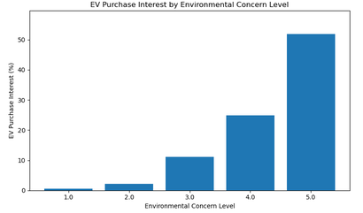
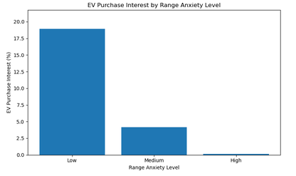
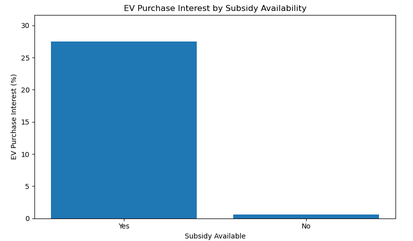
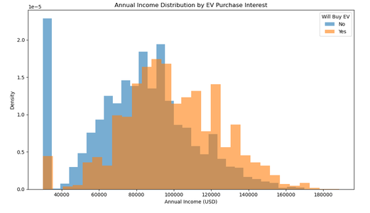
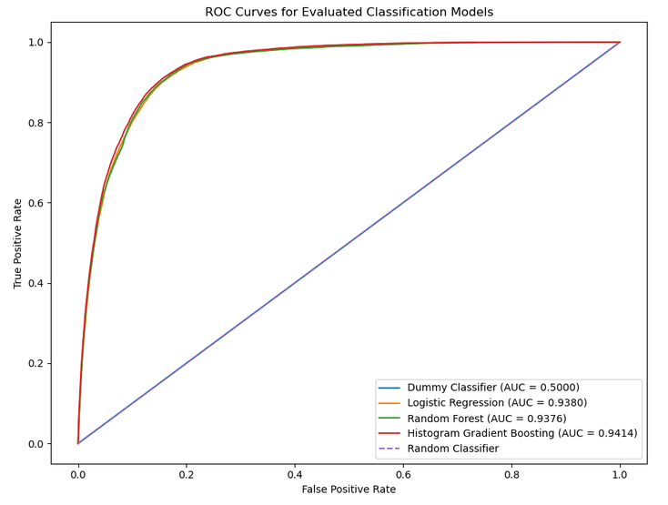
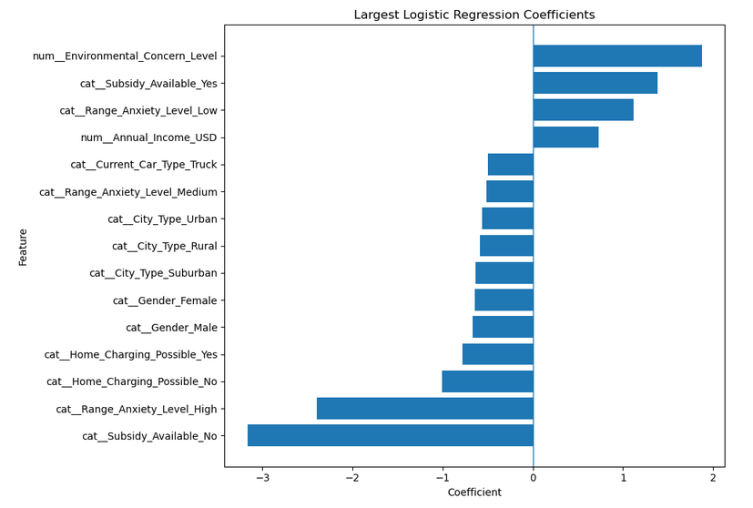

# Predicting Electric Vehicle Purchases

This project develops and evaluates machine learning classification models to predict whether an individual is likely to purchase an electric vehicle. The analysis uses demographic, financial, transportation, charging-access, and attitudinal characteristics from a Kaggle Playground competition dataset.

The project includes exploratory data analysis, preprocessing, model comparison, limited hyperparameter tuning, final model training, and external evaluation through a Kaggle competition submission.

## Analysis Notebook

The complete analysis is available in:

[`notebooks/PredictingEVPurchases.ipynb`](notebooks/PredictingEVPurchases.ipynb)

## Project Objective

The objective of this project is to predict `Will_Buy_EV`, a binary target indicating whether an individual is likely to purchase an electric vehicle.

The analysis focuses on two related goals:

- Identify characteristics associated with EV purchase interest.
- Develop a classification model that can rank purchase likelihood accurately on unseen data.

Because the target variable is imbalanced, ROC AUC is used as the primary evaluation metric rather than classification accuracy.

## Dataset

The project uses data from the Kaggle Playground competition **Predicting Electric Vehicle Purchases**.

The training dataset contains:

- **668,665 observations**
- **13 predictor variables**
- **1 binary target variable**
- Approximately **17.5%** positive observations

Predictors include characteristics related to:

- Age and gender
- Annual income
- City type
- Daily commute distance
- Current vehicle type
- Number of vehicles owned
- Home charging availability
- Charging stations near home and work
- Environmental concern
- Range anxiety
- Subsidy availability

The original competition files are not stored in this repository. See [`data/README.md`](data/README.md) for information about obtaining the data.

## Exploratory Data Analysis

Exploratory analysis showed that several variables were strongly associated with EV purchase interest.

Some of the clearest descriptive differences were observed for:

- **Environmental concern**
- **Range anxiety**
- **Subsidy availability**
- **Home charging availability**
- **Annual income**

Environmental concern showed a particularly strong pattern, with EV purchase interest increasing substantially at higher concern levels.



Range anxiety showed the opposite pattern, with lower purchase interest among individuals reporting higher levels of anxiety about driving range.



Subsidy availability was also associated with a substantial difference in EV purchase interest.



Annual income showed additional separation between the two target groups.



## Data Preparation

The modeling workflow separates predictor variables from the target and removes the record identifier from the feature set.

Numerical variables are standardized using `StandardScaler`, while categorical variables are transformed using `OneHotEncoder`. These preprocessing steps are incorporated into the modeling workflow to reduce the risk of data leakage.

The training dataset is divided into training and validation subsets using an 80/20 stratified split so that the target distribution is preserved across both datasets.

## Models Evaluated

The project compares several classification approaches:

- Dummy classifier
- Logistic regression
- Random forest
- Histogram gradient boosting

The dummy classifier establishes a baseline with a ROC AUC of 0.5000.

The predictive models achieved the following validation results:

| Model | Validation ROC AUC |
|---|---:|
| Dummy Classifier | 0.5000 |
| Logistic Regression | 0.9380 |
| Random Forest | 0.9376 |
| Histogram Gradient Boosting | 0.9414 |

Histogram gradient boosting produced the strongest validation performance.



## Model Interpretation

Logistic regression coefficients were examined to compare model-based feature importance with patterns identified during exploratory analysis.

Variables with some of the larger coefficient magnitudes included:

- Subsidy availability
- Range anxiety
- Environmental concern
- Home charging availability
- Annual income

These results were generally consistent with the descriptive patterns identified during exploratory analysis.



The coefficient analysis is descriptive and should not be interpreted as evidence that these characteristics cause EV purchasing decisions.

## Hyperparameter Tuning

Because histogram gradient boosting produced the strongest initial validation result, a limited set of model configurations was evaluated.

The best-performing configurations were extremely close:

| Configuration | ROC AUC |
|---|---:|
| Fewer Leaf Nodes | 0.941398 |
| Initial Configuration | 0.941396 |
| More Regularization | 0.941378 |
| Lower Learning Rate | 0.941344 |

The 15-leaf configuration was selected because it achieved essentially the same validation performance as the larger initial model while using lower tree complexity.

The final model used:

- Learning rate: **0.10**
- Maximum iterations: **200**
- Maximum leaf nodes: **15**
- L2 regularization: **1.0**

## Final Results

The selected histogram gradient boosting model achieved:

- **Local validation ROC AUC:** `0.941398`
- **Kaggle public leaderboard ROC AUC:** `0.94118`

The difference between the local validation score and Kaggle public leaderboard score was only **0.000218**.

The close agreement between these scores indicates that the validation procedure provided a useful estimate of model performance on unseen competition data.

## Limitations

Several limitations should be considered when interpreting the results.

The relationships identified in this project are predictive rather than causal. Variables such as environmental concern, subsidy availability, income, and charging access may be related to other factors that are not represented in the dataset.

The analysis is also limited to the variables included in the competition data. Other factors that could influence EV purchasing decisions, including vehicle price, electricity rates, gasoline prices, vehicle availability, household characteristics, and prior EV experience, are not included.

The target is imbalanced, with approximately 17.5% of the training observations classified as likely EV purchasers. ROC AUC was therefore used as the primary evaluation metric.

The Kaggle public leaderboard score reflects performance on the public portion of the competition test data and should be considered an additional evaluation rather than a replacement for the validation process.

## Repository Structure

```text
EV-Purchase-Prediction/
│
├── data/
│   └── README.md
│
├── images/
│   ├── EVPurchaseInterestByEnvironmentalConcernLevel.png
│   ├── EVPurchaseInterestByRangeAnxietyLevel.png
│   ├── EVPurchaseInterestBySubsidyAvailability.png
│   ├── AnnualIncomeDistributionEVPurchaseInterest.png
│   ├── LargestLogisticRegressionCoefficients.png
│   └── ROC_CurvesForEvaluatedClassificationModels.png
│
├── notebooks/
│   └── PredictingEVPurchases.ipynb
│
├── .gitignore
├── README.md
└── requirements.txt
